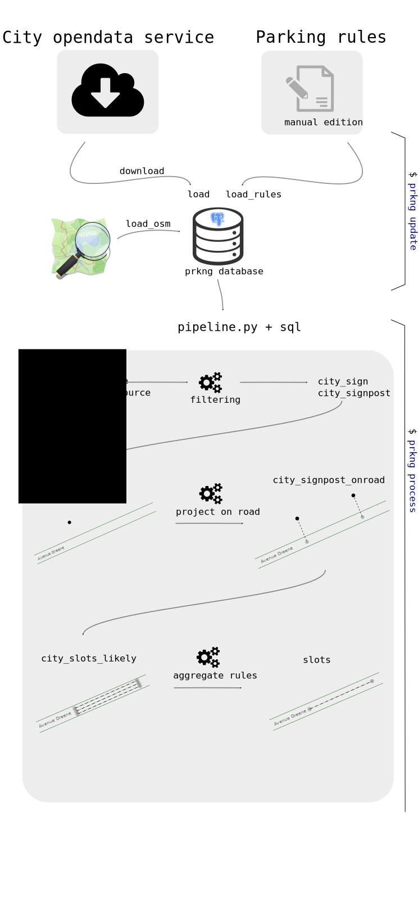

Ajout d'une nouvelle ville
==========================

.. note::

    Tous les chemins de fichiers seront relatifs à la racine du projet prkng.

.. note::

    Le système de projection cartographique utilisé dans tous les traitements est
    le WGS 84 / Pseudo-Mercator EPSG:3857

Pour ajouter les données de stationnement d'une ville il faut réaliser les étapes suivantes:

.. contents::
    :local:
    :depth: 1

L'enchainement des traitements peut être illustré par le diagramme suivant:

Fournir un fichier de règles de stationnement
---------------------------------------------

Ce fichier permet de faire la correspondance entre les codes portés par les panneaux
et la description de la règle de stationnement associée.

Le modèle à suivre est celui initialement créé par Mudar Noufal (`<https://github.com/mudar/StationnementSurRueMontreal>`_)
qui a traduit une grande partie des règles de stationnement pour Montréal.

Ce fichier doit est placé dans le répertoire ``prkng/data`` et il est nommé ``rules_nomville.csv``.
Les champs à décrire sont les suivants::

    "code","description","season_start","season_end","time_max_parking",
    "time_start","time_end","time_duration",
    "lun","mar","mer","jeu","ven","sam","dim","daily",
    "special_days","restrict_typ"

Prendre le fichier de Montréal comme exemple : ``prkng/data/rules_montreal.csv``

Écrire une classe de téléchargement/chargement des données
----------------------------------------------------------

Le module ``downloader.py`` permet d'écrire une classe pour chaque nouvelle
source de donnée.

Cette classe devra hériter de la classe ``DataSource`` et implémenter les méthodes suivantes:

.. py:class:: City(DataSource)

    .. py:method:: download()

        Télécharge les données de la source opendata (api CKAN par exemple)

    .. py:method:: load()

        Charge les données téléchargées (panneaux de stationnement)

    .. py:method:: load_rules()

        Charge les règles de stationnement ``rules_nomville.csv``

    .. py:method:: get_extent()

        Permet de récupérer l'étendue géographique des données chargées.
        Cette méthode est utilisée par le module de chargement des données
        OpenStreetMap pour ne télécharger que les données nécessaires.

Tester le chargement des nouvelles données
------------------------------------------

Il suffit de lancer la commande ``prkng`` suivante

.. code-block:: bash

    $ prkng update

.. warning::

    lors de cette opération toutes les données des villes sont re-téléchargées et
    rechargées en base, les tables cibles seront réécrasées.

Coder les fonctions de traitement de données
--------------------------------------------

La commande ``prkng process`` permet de lancer des traitement qui prennent les tables sources
précédemment chargées et doivent aboutir à l'insertion de données dans une table finale
appelée ``slots``

C'est le module ``prkng/processing/pipeline.py`` qui orchestre tout cela pour chaque ville.

Il faut écrire une fonction qui permet de regrouper tous les traitements nécessaires à une ville.

.. py:function:: process_city

Il faut ensuite l'appeler depuis la fonction ``run``.

Description des étapes de création des slots:

    - Réorganisation des régles de stationnement vers un modèle plus simple en base -> table ``rules`` (même fonction
      appelée pour toutes les villes puisque les règles sont écrites de la même manière)
    - Filtrer les panneaux et poteaux associés pour ne garder que ceux intéressants
      (tables ``city_sign`` et ``city_signpost``)
    - Si le fournisseur de données n'a pas fourni de lien entre les poteaux de stationnement et les routes OSM,
      il faut alors générer la correspondance entre les routes fournies par la ville et les routes OSM
      (cas de Montréal avec la géobase par exemple)
    - Projeter les poteaux sur la voie correspondante en déterminant si ceux-ci sont à droite ou à gauche de la voie.
      (table ``city_signpost_onroad``)
    - Générer éventuellement une table d'orphelins pour les poteaux qui n'ont pas pu être projetés (table ``city_signpost_orphans``)
      faute de bonne correspondance entre les
    - Créer des emplacements de stationnement potentiels en créant des segments entre chaque poteau projeté (table ``city_slots_likely``)
    - Pour chaque poteau, identifier les poteaux l'entourant en précisant s'ils sont à sa droite ou à sa gauche (par rapport au centre de la rue)
      Ces informations permettront d'associer la direction donnée sur les panneaux avec le bon segment (slot).
    - Insérer les données finales dans une table ``slots`` en agrégeant pour chacun les infos des panneaux de début et de fin de stationnement.

Voici la structure de la table finale slots:

.. code-block:: sql

    CREATE TABLE slots
    (
      -- identifiant unique du slot de parking
      id serial PRIMARY KEY,
      -- tableau contenant la liste des poteaux entre lesquels le slot a été créé
      -- (0 pour une fin de rue, ie une intersection)
      signposts integer[],
      -- liste de régles de stationnement qui sont portées par ce slot
      -- avec pour chaque régle un agenda des interdictions
      rules jsonb,
      -- le nom de la voie avec laquelle le slot a été créé puis décalé par rapport à celle-ci
      way_name varchar,
      -- la géométrie ?
      geom geometry(LineString,3857),
      -- la géométrie en geojson préparée pour une sortie plus rapide
      geojson jsonb,
      -- l'emplacement du centre du slot de stationnement {'long': ... , 'lat': ...}
      button_location jsonb
    )
